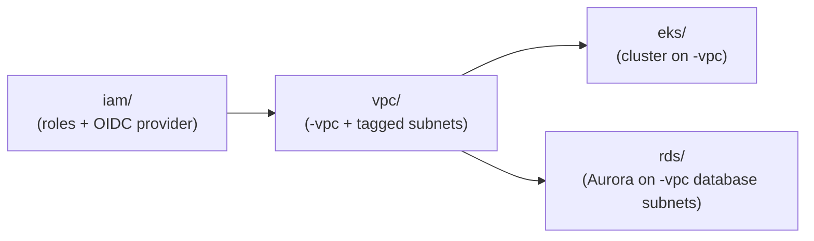

# Infra

This repository contains the Terraform configuration for the AWS infrastructure. It is organized as a set of independent **root modules** — one per top-level directory — each owning its own state, providers, and environments. There is no single `terraform apply` for the whole repo; every directory is planned and applied on its own, normally via the shared [`Jenkinsfile`](Jenkinsfile) pipeline.

## Root modules

A **module** in Terraform is any directory containing `.tf` files — a self-contained set of resources, variables, and outputs. A **root module** is the module you run `terraform init`/`plan`/`apply` in directly; it's the entry point and owns its own state, providers, and backend configuration.

| Module | Purpose | State key (S3) |
|---|---|---|
| [`iam/`](iam/) | Foundational IAM roles, policies, and the GitHub Actions OIDC provider used by every other module's pipeline | `infra/iam/terraform.tfstate` |
| [`vpc/`](vpc/) | Per-environment AWS VPC: public/private/intra/database subnet tiers, NAT, flow logs | `infra/vpc/terraform.tfstate` |
| [`eks/`](eks/) | EKS control plane, managed node group, core add-ons, Karpenter autoscaler, secrets plumbing | `infra/eks-core/terraform.tfstate` |
| [`rds/`](rds/) | Aurora PostgreSQL cluster, KMS encryption, security group, SSM credential storage | `infra/rds/terraform.tfstate` |

All state is stored in the same S3 bucket (`terraform-infra-state-backend`, `ap-south-1`), each module under its own `key` (see each module's `backend.tf`).

### Dependency order

`vpc/`, `eks/`, and `rds/` discover their networking and IAM roles **by tag/name** rather than via Terraform remote state — so modules must exist (not necessarily be in the same apply) in this order:



- `iam/` must exist first — every other module assumes a role created here (e.g. `PlatformVPCRole`, `ControlPlaneBaseRole`, `PlatformStorageRole`).
- `vpc/` must exist before `eks/` or `rds/` — both discover the VPC named `<env>-vpc` and its tagged subnets by `data` source lookups.
- `eks/` and `rds/` are independent of each other.

## Child (sub) modules

A **child (sub) module** is a module called from within another module's configuration via a `module` block, instead of declaring its resources inline. It's how Terraform configurations reuse and encapsulate infrastructure — the calling (root) module passes inputs and consumes outputs, while the child module's own resources stay private to it. Child modules can be local directories or, as below, versioned modules pulled from the Terraform Registry.

Each root module composes published [terraform-aws-modules](https://github.com/terraform-aws-modules) / [aws-ia](https://github.com/aws-ia) modules rather than defining everything from raw resources:

| Root module | Child module | Source | Version |
|---|---|---|---|
| `iam/` | OIDC provider | `terraform-aws-modules/iam/aws//modules/iam-oidc-provider` | `6.3.0` |
| `iam/` | `GHActionsRole` | `terraform-aws-modules/iam/aws//modules/iam-role` | `6.3.0` |
| `vpc/` | VPC + subnets + flow logs | `terraform-aws-modules/vpc/aws` | `5.21.0` |
| `eks/` | EKS cluster + node group | `terraform-aws-modules/eks/aws` | `~> 21.22.0` |
| `eks/` | `aws-node` (VPC CNI) pod identity | `terraform-aws-modules/eks-pod-identity/aws` | `~> 2.8.0` |
| `eks/` | EBS CSI driver + pod identity | `aws-ia/eks-blueprints-addons/aws`, `terraform-aws-modules/eks-pod-identity/aws` | `~> 1.23.0`, `~> 2.8.0` |
| `eks/` | Karpenter (IAM role, SQS queue, pod identity) | `terraform-aws-modules/eks/aws//modules/karpenter` | `21.22.0` |
| `rds/` | — (native `aws_rds_cluster*` resources only) | — | — |

Karpenter's controller, CRDs, `EC2NodeClass`/`NodePool` manifests, and the Secrets Store CSI driver are installed via `helm_release` / `kubernetes_manifest` rather than registry modules — see [`eks/karpenter_deployment.tf`](eks/karpenter_deployment.tf) and [`eks/secrets-store-csi-driver-provider-aws.tf`](eks/secrets-store-csi-driver-provider-aws.tf).

## Directory structure

```
.
├── Jenkinsfile      # shared pipeline: fmt/lint/scan/plan/apply for any module + env
├── iam/             # root module — IAM roles, OIDC provider (deploy first)
├── vpc/             # root module — per-env VPC and subnets
├── eks/             # root module — EKS cluster, add-ons, Karpenter
└── rds/             # root module — Aurora PostgreSQL cluster
```

Each root module follows the same internal layout:

```
<module>/
├── backend.tf            # S3 backend (own state key)
├── versions.tf           # required providers/versions
├── variables.tf          # input variables
├── main.tf / *.tf         # resources and child module calls
├── data.tf                # cross-module discovery (VPC, subnets, IAM roles by tag/name)
├── outputs.tf             # (where applicable)
├── environments/          # one <env>.auto.tfvars.json per environment
│   ├── dev.auto.tfvars.json
│   ├── qa.auto.tfvars.json
│   ├── uat.auto.tfvars.json
│   └── prod.auto.tfvars.json
├── .checkov.yaml / trivy.yaml / .trivyignore   # security scanning config
└── README.md              # module-specific architecture, variables, usage
```

`eks/` additionally has `tpl/` (Karpenter Helm values + NodePool/NodeClass manifests), `scripts/`, and `test/` (example Karpenter workloads).

See each module's own README for full architecture details, variable reference, and module-specific notes:

- [`iam/README.md`](iam/README.md)
- [`vpc/README.md`](vpc/README.md)
- [`eks/README.md`](eks/README.md)
- [`rds/README.md`](rds/README.md)

## Environments

All modules share the same set of environments, deployed as Terraform **workspaces** within AWS account `891543987898` (`ap-south-1`):

| Environment | Workspace / `<env>` |
|---|---|
| Development | `dev` |
| QA | `qa` |
| UAT | `uat` |
| Production | `prod` |

## Usage

### Via Jenkins (recommended)

The [`Jenkinsfile`](Jenkinsfile) provides a single parameterized pipeline for all modules:

- **`INFRA`** — which root module to operate on: `vpc`, `rds`, `eks`, `iam`
- **`ENV`** — target environment / workspace: `dev`, `qa`, `uat`, `prod`
- **`AWS_REGION`** — `ap-south-1`

It runs `terraform fmt`, `tflint`, `trivy config`, `init`, `workspace select/new`, `validate`, `plan`, then waits for manual approval before `apply`. For `eks`, it additionally runs `scripts/apply-karpenter-manifests.sh` after apply.

### Locally

From within the chosen module's directory:

```bash
cd <module>            # iam | vpc | eks | rds
terraform init
terraform workspace select <env> || terraform workspace new <env>

terraform plan  -var-file=environments/<env>.auto.tfvars.json -out=tfplan
terraform apply tfplan
```

`<module>` and `<env>` correspond to the `INFRA`/`ENV` parameters above. When provisioning a brand-new environment, apply in dependency order: `iam` → `vpc` → (`eks`, `rds`).

## Prerequisites

- [Terraform](https://www.terraform.io/downloads) >= 1.9
- AWS credentials able to assume the relevant `Roles/*` role (provisioned by `iam/`) in account `891543987898`
- For `eks`: `kubectl` and Helm-capable providers (configured automatically by `terraform init`)
