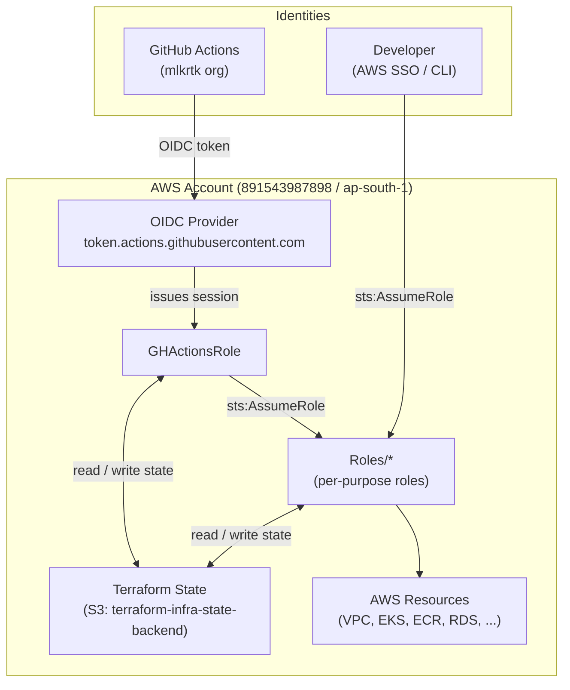

# IAM

Terraform configuration that provisions all least-privilege IAM roles used by the mlkrtk platform pipelines. It also configures the GitHub Actions OIDC provider, enabling all pipelines to authenticate to AWS without stored credentials.

This is the foundational repository for the platform — all other repositories depend on the roles deployed here.

## Account Structure

All environments are deployed into a single AWS account using Terraform workspaces:

| Account | ID | Region | Purpose |
|---|---|---|---|
| **Platform** | 891543987898 | ap-south-1 | Hosts all environments (dev / qa / uat / prod) and Terraform state |

Terraform workspaces (`dev`, `qa`, `uat`, `prod`) provide logical separation within the account.

## Authentication Model

GitHub Actions workflows authenticate to AWS via OIDC — no stored credentials are used. The `GHActionsRole` is issued a short-lived session when a workflow in the `mlkrtk` GitHub organisation presents a valid OIDC token, then assumes the appropriate deployment role for the operation.



## IAM Roles

All roles are placed in the `/Roles/` path and all policies in `/Policies/`. Roles that need to perform deployments also receive read/write access to the Terraform state bucket (`S3StateBucketPolicy`).

All roles (except `GHActionsRole` and `GHAppDeployerRole`) trust the account root (`arn:aws:iam::891543987898:root`), allowing any principal in the account with `sts:AssumeRole` permission to assume them.

`GHActionsRole` and `GHAppDeployerRole` use GitHub OIDC federation directly, scoped to `repo:mlkrtk/*`.

| Role | Purpose |
|---|---|
| `GHActionsRole` | Assumed by GitHub Actions via OIDC. Permitted to assume any `Roles/*` role in the account. State account only. |
| `GHAppDeployerRole` | GitHub Actions application deployment (ECR, EKS, Secrets Manager, SSM, KMS) |
| `IamProfilesRole` | IAM management — used by this repository to create and update all other roles. **Bootstrap role** (see below). |
| `PlatformVPCRole` | VPC and subnet management — used by `platform-vpc` |
| `ControlPlaneBaseRole` | EKS cluster, Karpenter, add-ons, KMS, Route53 — used by `platform-core` and `platform-core-extensions` |
| `PlatformStorageRole` | S3, RDS, ECR, ECS, and associated IAM and networking |
| `PlatformObservabilityBaseRole` | CloudWatch Logs and Amazon Managed Prometheus |
| `AppDeployerRole` | Manual developer application deployment and testing (ECR, EKS, Secrets Manager, SSM, KMS) |

## GitHub Actions OIDC Federation

The account hosts an IAM OIDC provider for `https://token.actions.githubusercontent.com`. Any workflow in the **mlkrtk GitHub organisation** (`repo:mlkrtk/*`) can exchange a GitHub-issued OIDC token for a short-lived session in `GHActionsRole` or `GHAppDeployerRole` — no secrets are stored in GitHub.

## Bootstrap

> **This only applies when onboarding into a new AWS account.** Existing accounts do not need to be re-bootstrapped.

There is a one-time chicken-and-egg problem when onboarding: `platform-iam` uses `IamProfilesRole` to manage IAM, but that role does not exist until it is first deployed. The first deployment must be done manually with credentials that have IAM permissions in the account.

**Steps to bootstrap:**

1. **Authenticate** to the AWS account directly with credentials that have IAM management permissions (e.g. temporary admin credentials).

2. **Comment out the `assume_role` block** in `versions.tf` (it is already commented out by default for this reason).

3. **Create the workspace and apply:**
   ```bash
   terraform init
   terraform workspace new <environment>
   terraform apply -var-file environments/<environment>.auto.tfvars.json
   ```
   This creates `IamProfilesRole` (and all other roles) in the account.

4. **All subsequent changes** can now be applied normally — see [Deployments](#deployments).

> After bootstrap, uncomment the `assume_role` block in `versions.tf` so that Terraform authenticates via `IamProfilesRole` rather than direct credentials.

## Deployments

Authenticate via AWS SSO or CLI, then run:

```bash
terraform init
terraform workspace select <environment>
terraform plan -var-file environments/<environment>.auto.tfvars.json
terraform apply -var-file environments/<environment>.auto.tfvars.json
```

Available workspaces: `dev`, `qa`, `uat`, `prod`.

## Adding a New Environment

1. **Create a tfvars file** in `environments/` named `<environment>.auto.tfvars.json`. Copy an existing file as a template.

   Required variables:

   | Variable | Description | Example |
   |---|---|---|
   | `aws_region` | AWS region | `"ap-south-1"` |
   | `aws_account_id` | 12-digit AWS account ID | `"891543987898"` |
   | `aws_assume_role` | Bootstrap role to assume | `"Roles/IamProfilesRole"` |
   | `is_state_account` | Whether this account hosts the OIDC provider | `true` |
   | `app_env` | Short environment name | `"staging"` |

2. **Bootstrap the account** if this is a new AWS account — follow the [Bootstrap](#bootstrap) steps above.

## Prerequisites

- [Terraform](https://www.terraform.io/downloads) ~> 1.9
- AWS CLI configured for account `891543987898` (ap-south-1)
- Temporary admin credentials required only during the one-time bootstrap

## Code Quality & Security

Pre-commit hooks enforce quality checks on every commit. Install them once after cloning:

```bash
pip install pre-commit
pre-commit install
```

| Tool | Purpose |
|---|---|
| `terraform fmt` | Formatting |
| `terraform validate` | Configuration validity |
| TFLint | Linting and best-practice checks |
| Trivy | Vulnerability and misconfiguration scanning |
| Checkov | IAM policy compliance |
| git-secrets | Prevents accidental secret commits |
