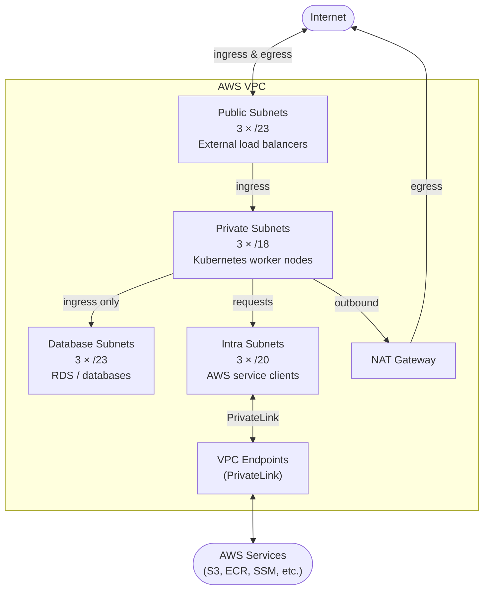

# VPC

Terraform configuration that provisions the AWS VPC networking layer. To support scale and compliance requirements, multiple instances may be deployed within a region or across regions — each instance requires a dedicated VPC provisioned by this repository.

The VPCs deployed here provide the network foundation for Kubernetes worker nodes, managed databases, and AWS service connectivity consumed by the broader infrastructure.

## Architecture

### VPC Subnet Tiers

Each VPC spans three availability zones and is divided into four subnet tiers that provide network isolation with controlled traffic flows:



| Tier | CIDR Size | Purpose | Ingress | Egress |
|---|---|---|---|---|
| **Public** | /23 × 3 AZs | External load balancers | Internet | Internet via IGW |
| **Private** | /18 × 3 AZs | Kubernetes worker nodes | Public subnets | Internet via NAT Gateway |
| **Database** | /23 × 3 AZs | RDS / data stores | Private subnets | None |
| **Intra** | /20 × 3 AZs | Internal AWS service traffic | Private subnets | AWS services via PrivateLink |

### Kubernetes Integration

Subnets are tagged for automatic discovery by EKS and Karpenter:

- **Private subnets** — tagged `karpenter.sh/discovery` and `kubernetes.io/role/internal-elb` for node provisioning and internal load balancers
- **Public subnets** — tagged `kubernetes.io/role/elb` for external load balancer provisioning

## Environments

Each environment has a dedicated tfvars file in `environments/` named `{env}.auto.tfvars.json` and a corresponding Terraform workspace.

| Environment | Name | AWS Account | VPC CIDR |
|---|---|---|---|
| Development | `dev` | 891543987898 | 10.70.0.0/16 |
| QA | `qa` | 891543987898 | 10.80.0.0/16 |
| UAT | `uat` | 891543987898 | 10.85.0.0/16 |
| Production | `prod` | 891543987898 | 10.90.0.0/16 |

## Deployment

To plan or apply changes to an environment:

```bash
terraform init
terraform workspace select <environment>
terraform plan -var-file environments/<environment>.auto.tfvars.json
terraform apply -var-file environments/<environment>.auto.tfvars.json
```

Example for production:

```bash
terraform init
terraform workspace select prod
terraform plan -var-file environments/prod.auto.tfvars.json
terraform apply -var-file environments/prod.auto.tfvars.json
```

## Adding a New Environment

1. **Create a tfvars file** in `environments/` named `{env}.auto.tfvars.json`. Copy an existing file as a starting point.

   Required variables:

   | Variable | Description | Example |
   |---|---|---|
   | `vpc_name` | Environment/VPC name | `"uat"` |
   | `aws_region` | AWS region | `"ap-south-1"` |
   | `aws_account_id` | 12-digit AWS account ID | `"891543987898"` |
   | `aws_assume_role` | IAM role path for cross-account access | `"Roles/PlatformVPCRole"` |
   | `vpc_cidr` | VPC CIDR block | `"10.85.0.0/16"` |
   | `vpc_azs` | Exactly 3 availability zones | `["ap-south-1a","ap-south-1b","ap-south-1c"]` |
   | `vpc_private_subnets` | 3 private subnet CIDRs (/18 recommended) | |
   | `vpc_intra_subnets` | 3 intra subnet CIDRs (/20 recommended) | |
   | `vpc_public_subnets` | 3 public subnet CIDRs (/23 recommended) | |
   | `vpc_database_subnets` | 3 database subnet CIDRs (/23 recommended) | |

2. **Choose a non-overlapping VPC CIDR.** Review the table above to ensure the new CIDR does not conflict with any existing environment.

3. **Ensure the IAM assume role exists** in the target AWS account. The role `Roles/PlatformVPCRole` must have permissions to manage VPC resources and read/write the Terraform S3 state backend.

4. **Create the Terraform workspace:**

   ```bash
   terraform workspace new <environment>
   ```

## Prerequisites

- [Terraform](https://www.terraform.io/downloads) >= 1.9
- AWS credentials with permission to assume `Roles/PlatformVPCRole` in the target account
- Access to the Terraform S3 state backend

## Code Quality & Security

Pre-commit hooks enforce quality checks on every commit. Install them once after cloning:

```bash
pip install pre-commit
pre-commit install
```

| Tool | Purpose |
|---|---|
| `terraform fmt` | Formatting |
| `terraform validate` | Configuration validity |
| TFLint | Linting and best-practice checks |
| Trivy | Vulnerability and misconfiguration scanning |
| Checkov | Infrastructure policy compliance |
| git-secrets | Prevents accidental secret commits |

## Notes

- **VPC flow logs** are enabled by default, with a dedicated CloudWatch log group and IAM role created per environment.
